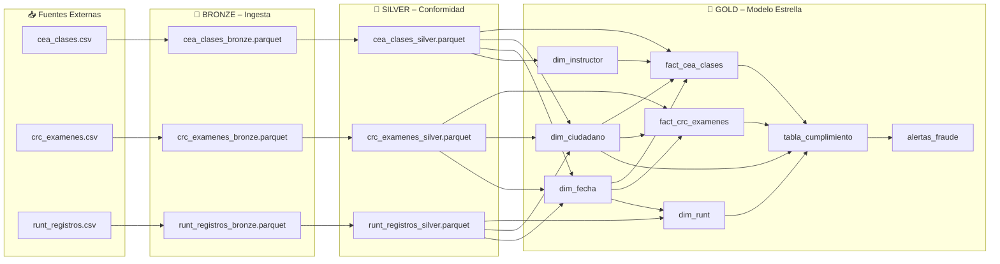
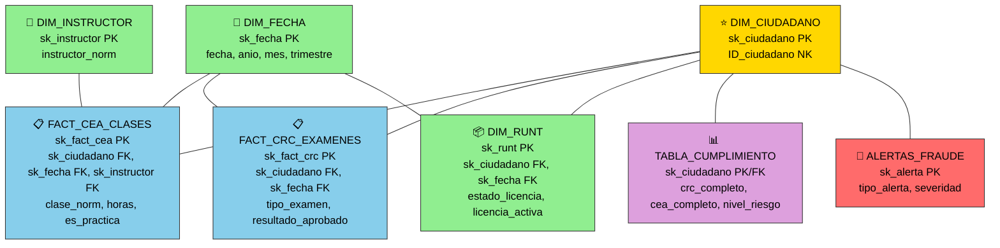
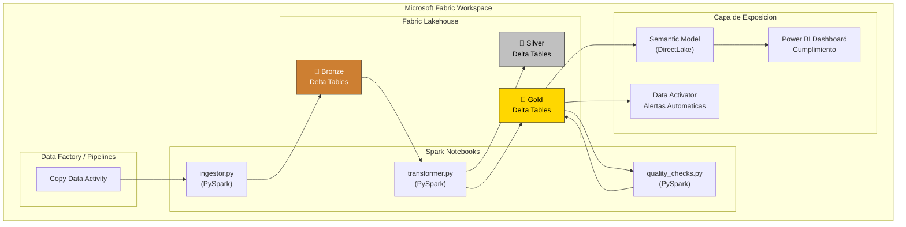

# Diseño de Arquitectura – Olimpia Data Pipeline

## 1. Arquitectura Medallón (Bronze → Silver → Gold)

Se adopta el patrón **Medallion Architecture** con las tres capas estándar:

```
BRONZE  →  SILVER  →  GOLD
(raw)      (clean)    (business)
```

### ¿Por qué este patrón y no otro?

| Alternativa | Por qué NO se eligió |
|-------------|----------------------|
| Data Warehouse clásico (star schema puro) | Requiere esquema rígido desde el inicio; difícil de evolucionar con nuevas fuentes |
| Normalización 3FN en base relacional | Excesiva complejidad de JOINs para análisis; no escala bien con volumen |
| Raw directo a exposición | Sin linaje, sin calidad, sin auditoría |
| **Medallion / Data Lakehouse** ✅ | Flexibilidad de esquema en Bronze, calidad incremental, trazabilidad, compatible con Fabric |

---

## 2. Capas del Lakehouse

### BRONZE (Capa de Ingesta)
- **Qué contiene**: datos tal como llegan de las fuentes, enriquecidos solo con metadatos de ingesta.
- **Formato**: CSV originales + Parquet validado.
- **Quién escribe**: `ingestor.py` únicamente.
- **Retención**: indefinida (auditoría regulatoria).
- **Metadatos añadidos**: `_source`, `_ingested_at`, `_file_hash`, `_row_hash`.
- **Directorio**: `data/bronze/`

### SILVER (Capa de Conformidad)
- **Qué contiene**: datos limpios, normalizados, con campos derivados.
- **Formato**: Parquet (en producción: Delta Lake para ACID + time travel).
- **Reglas aplicadas**: deduplicación, normalización fechas/texto, campos enriquecidos.
- **Quién escribe**: `transformer.py`.
- **Directorio**: `data/silver/`

### GOLD (Capa de Negocio)
- **Qué contiene**: modelo dimensional (esquema estrella) + tablas de análisis.
- **Tablas**:
  - `dim_ciudadano` – dimensión central, todos los IDs únicos con surrogate key + trazabilidad.
  - `dim_fecha` – dimensión calendario con año, mes, día, trimestre, fin de semana.
  - `dim_instructor` – dimensión de instructores CEA únicos.
  - `fact_cea_clases` – hechos granulares de clases (grain: ciudadano + clase + fecha).
  - `fact_crc_examenes` – hechos granulares de exámenes (grain: ciudadano + tipo + fecha).
  - `dim_runt` – estado más reciente de licencia por ciudadano.
  - `tabla_cumplimiento` – vista analítica cruzada, lista para dashboards.
  - `alertas_fraude` – señales de anomalías detectadas.
- **Directorio**: `data/gold/`

---

## 3. Flujo de Datos por Capas



---

## 4. Modelo de Datos – Esquema Estrella (Star Schema)

### ¿Por qué Estrella y no Copo de Nieve?

| Criterio | Star Schema ✅ | Snowflake ❌ |
|----------|---------------|-------------|
| Complejidad de JOINs | Baja (1 nivel) | Alta (múltiples niveles) |
| Rendimiento en consultas | Óptimo para BI | Más lento por JOINs cascada |
| Facilidad para Power BI | Nativa (DirectLake) | Requiere vistas intermedias |
| Redundancia controlada | Sí (desnormalizado) | No (normalizado) |
| Mantenimiento | Sencillo | Complejo |

**Se eligió Esquema Estrella** porque:
1. Las dimensiones conformadas (ciudadano, fecha, instructor, RUNT) son pocas y simples.
2. No hay jerarquías profundas que justifiquen normalizar dimensiones en sub-tablas.
3. Power BI trabaja nativamente con star schema.
4. El grain de los hechos es el más granular posible (cada clase / cada examen).
5. `DIM_FECHA` habilita análisis temporal (trimestre, mes, fin de semana) sin lógica en consultas.
6. `DIM_INSTRUCTOR` permite análisis de carga y detección de fraude (F5) por instructor.
7. `tabla_cumplimiento` es una **fact table desnormalizada** (una fila por ciudadano) optimizada para el dashboard.

### Diagrama Entidad-Relación (Gold Layer)

```mermaid
erDiagram
    DIM_CIUDADANO {
        bigint sk_ciudadano PK "Surrogate Key"
        bigint ID_ciudadano NK "ID natural del ciudadano"
        string _gold_run_id "ID corrida Gold"
        timestamp _created_at "Fecha creacion"
    }

    DIM_FECHA {
        int sk_fecha PK "Surrogate Key"
        date fecha "Fecha calendario"
        int anio "Anio"
        int mes "Mes 1-12"
        int dia "Dia del mes"
        int trimestre "Trimestre 1-4"
        string nombre_mes "Nombre del mes"
        boolean es_fin_semana "Sabado o domingo"
    }

    DIM_INSTRUCTOR {
        bigint sk_instructor PK "Surrogate Key"
        string instructor_norm "Nombre instructor Title Case"
    }

    FACT_CEA_CLASES {
        bigint sk_fact_cea PK "Surrogate Key del hecho"
        bigint sk_ciudadano FK "FK dim_ciudadano"
        int sk_fecha FK "FK dim_fecha"
        bigint sk_instructor FK "FK dim_instructor"
        string clase_norm "Tipo de clase teorica o practica"
        int horas "Horas de la clase"
        boolean es_practica "Es clase practica"
        int horas_acum_ciudadano "Horas acumuladas"
        date fecha_date "Fecha de la clase"
    }

    FACT_CRC_EXAMENES {
        bigint sk_fact_crc PK "Surrogate Key del hecho"
        bigint sk_ciudadano FK "FK dim_ciudadano"
        int sk_fecha FK "FK dim_fecha"
        string tipo_examen_norm "medico psicologico coordinacion"
        boolean resultado_aprobado "Aprobo el examen"
        int examenes_aprobados_acum "Acumulado aprobados"
        date fecha_date "Fecha del examen"
    }

    DIM_RUNT {
        bigint sk_runt PK "Surrogate Key"
        bigint sk_ciudadano FK "FK dim_ciudadano"
        int sk_fecha FK "FK dim_fecha"
        string estado_licencia_norm "activa suspendida cancelada"
        boolean licencia_activa "Licencia vigente"
        int dias_desde_actualizacion "Dias desde ultima actualizacion"
    }

    TABLA_CUMPLIMIENTO {
        bigint sk_ciudadano PK "PK y FK dim_ciudadano"
        boolean crc_completo "3 examenes aprobados"
        boolean cea_completo "Teorica y practica"
        boolean proceso_completo "CRC y CEA completos"
        boolean inconsistencia_runt "Desajuste con RUNT"
        string nivel_riesgo "BAJO MEDIO ALTO CRITICO"
    }

    ALERTAS_FRAUDE {
        bigint sk_alerta PK "Surrogate Key"
        bigint ID_ciudadano FK "Ciudadano afectado"
        string tipo_alerta "F1 a F5 codigo de alerta"
        string detalle "Descripcion de la anomalia"
        string severidad "CRITICA ALTA MEDIA"
        timestamp detectado_en "Timestamp deteccion"
    }

    DIM_CIUDADANO ||--o{ FACT_CEA_CLASES : "tiene clases"
    DIM_CIUDADANO ||--o{ FACT_CRC_EXAMENES : "tiene examenes"
    DIM_CIUDADANO ||--o| DIM_RUNT : "tiene licencia"
    DIM_CIUDADANO ||--o| TABLA_CUMPLIMIENTO : "resumen cumplimiento"
    DIM_CIUDADANO ||--o{ ALERTAS_FRAUDE : "alertas asociadas"
    DIM_FECHA ||--o{ FACT_CEA_CLASES : "fecha clase"
    DIM_FECHA ||--o{ FACT_CRC_EXAMENES : "fecha examen"
    DIM_FECHA ||--o{ DIM_RUNT : "fecha actualizacion"
    DIM_INSTRUCTOR ||--o{ FACT_CEA_CLASES : "instructor clase"
```

### Estructura Visual del Esquema Estrella



---

## 5. Detalle de Relaciones (Foreign Keys)

| Tabla Origen | Columna FK | → Tabla Destino | Columna PK | Cardinalidad | Descripción |
|-------------|-----------|----------------|-----------|-------------|-------------|
| `fact_cea_clases` | `sk_ciudadano` | `dim_ciudadano` | `sk_ciudadano` | N:1 | Cada clase pertenece a un ciudadano |
| `fact_cea_clases` | `sk_fecha` | `dim_fecha` | `sk_fecha` | N:1 | Cada clase tiene una fecha |
| `fact_cea_clases` | `sk_instructor` | `dim_instructor` | `sk_instructor` | N:1 | Cada clase tiene un instructor |
| `fact_crc_examenes` | `sk_ciudadano` | `dim_ciudadano` | `sk_ciudadano` | N:1 | Cada examen pertenece a un ciudadano |
| `fact_crc_examenes` | `sk_fecha` | `dim_fecha` | `sk_fecha` | N:1 | Cada examen tiene una fecha |
| `dim_runt` | `sk_ciudadano` | `dim_ciudadano` | `sk_ciudadano` | 1:1 | Un registro RUNT por ciudadano (SCD Tipo 1) |
| `dim_runt` | `sk_fecha` | `dim_fecha` | `sk_fecha` | N:1 | Fecha de actualización RUNT |
| `tabla_cumplimiento` | `sk_ciudadano` | `dim_ciudadano` | `sk_ciudadano` | 1:1 | Resumen analítico por ciudadano |
| `alertas_fraude` | `ID_ciudadano` | `dim_ciudadano` | `ID_ciudadano` | N:1 | Múltiples alertas por ciudadano |

### Reglas de Negocio del Modelo

- **CRC completo** = tiene los 3 tipos de examen (médico, psicológico, coordinación) y todos aprobados.
- **CEA completo** = tiene al menos una clase teórica Y una práctica.
- **RUNT consistente** = licencia activa si CRC+CEA completos, o licencia no activa si proceso incompleto.
- **Inconsistencia RUNT** = proceso completo pero sin licencia activa, o viceversa.
- **Nivel de riesgo**:
  - `BAJO` = proceso completo y licencia consistente.
  - `MEDIO` = proceso incompleto, sin inconsistencia.
  - `ALTO` = proceso completo pero licencia NO activa.
  - `CRITICO` = proceso incompleto pero licencia activa (posible fraude).

---

## 6. Grain (Granularidad) de cada Tabla

| Tabla | Grain | Ejemplo |
|-------|-------|---------|
| `dim_ciudadano` | 1 fila por ciudadano único | Ciudadano 101 |
| `dim_fecha` | 1 fila por fecha única | 2025-01-15 |
| `dim_instructor` | 1 fila por instructor único | García López |
| `fact_cea_clases` | 1 fila por ciudadano + clase + fecha | Ciudadano 101, clase teórica, 2025-01-15 |
| `fact_crc_examenes` | 1 fila por ciudadano + tipo examen + fecha | Ciudadano 101, examen médico, 2025-02-01 |
| `dim_runt` | 1 fila por ciudadano (registro más reciente) | Ciudadano 101, licencia activa |
| `tabla_cumplimiento` | 1 fila por ciudadano (vista agregada) | Ciudadano 101, proceso completo, riesgo BAJO |
| `alertas_fraude` | 1 fila por alerta detectada | Ciudadano 101, F3_LICENCIA_SIN_CRC |

---

## 7. Arquitectura en Microsoft Fabric



### Mapa de módulos Python → componentes Fabric

| Módulo Python | Equivalente en Fabric |
|---------------|----------------------|
| `ingestor.py` | **Data Pipeline** + actividad Copy Data |
| `transformer.py` | **Spark Notebook** (PySpark) en Lakehouse |
| `quality_checks.py` | **Spark Notebook** + **Data Activator** para alertas |
| `tabla_cumplimiento` | **Semantic Model** → Power BI DirectLake |
| `alertas_fraude` | **Data Activator** → notificaciones Teams |

---

## 8. Decisiones Técnicas

| Decisión | Elección | Justificación |
|----------|----------|---------------|
| Lenguaje | Python 3.9+ | Ecosistema maduro, compatible con Fabric Notebooks y PySpark |
| Formato de almacenamiento | Parquet (local) / Delta Lake (Fabric) | Columnar, comprimido, soporte ACID en Delta |
| Motor | Pandas (dev) / PySpark (prod) | Mismo código, diferente escala |
| Orquestación | Script directo (dev) / Fabric Pipelines (prod) | Progresión natural sin lock-in |
| **Modelo de datos** | **Esquema Estrella** | Óptimo para Power BI, JOINs simples, sin jerarquías profundas |
| **Arquitectura de capas** | **Medallion (Bronze/Silver/Gold)** | Linaje completo, recuperabilidad, auditoría regulatoria |
| Dimensión RUNT | SCD Tipo 1 (sobrescribir) | Solo interesa el estado más reciente de la licencia |
| Surrogate keys | `sk_ciudadano` autoincremental | Desacopla el modelo analítico del ID natural |
